<h1>Install WSL<br>(Windows Subsystem for LaTeX eh Linux :)</h1>


Salam!

WSL hanya dapat diaktifkan pada Windows 10 versi 1607 (2016) keatas.
Melalui PowerShell (admin), aktifkan WSL dengan mengetikkan:

```PS
Enable-WindowsOptionalFeature -Online -FeatureName Microsoft-Windows-Subsystem-Linux
```

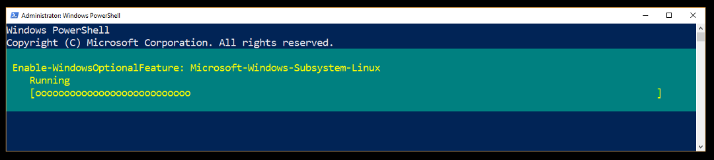

Selanjutnya, silakan restart komputer.

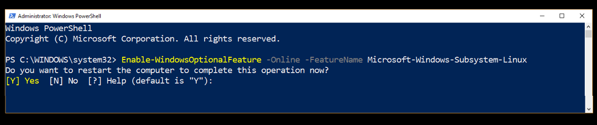

Jika pertama kali, seharusnya belum ada "bash" dalam sistem. Jadi -- jaga-jaga -- silakan test
apakah sudah terdapat "bash" (yang seharusnya tidak).

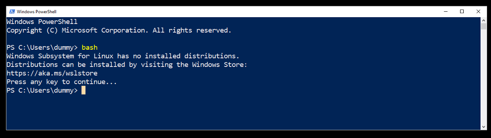

Melalui Microsoft Store, silakan INSTALL distribusi "kesayangan" bersama, yaitu UBUNTU.

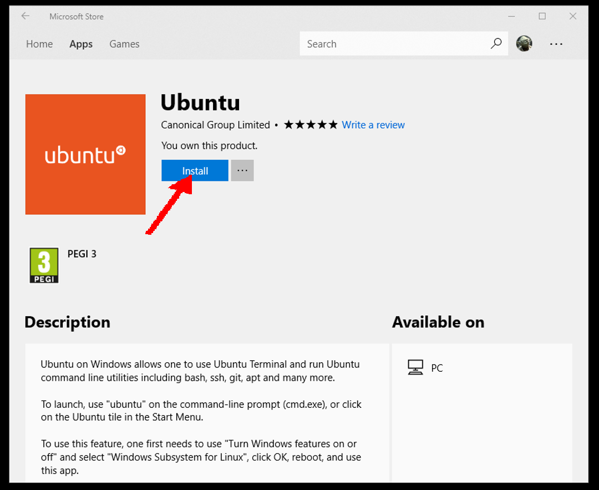

Setelah install, lalu LAUNCH.

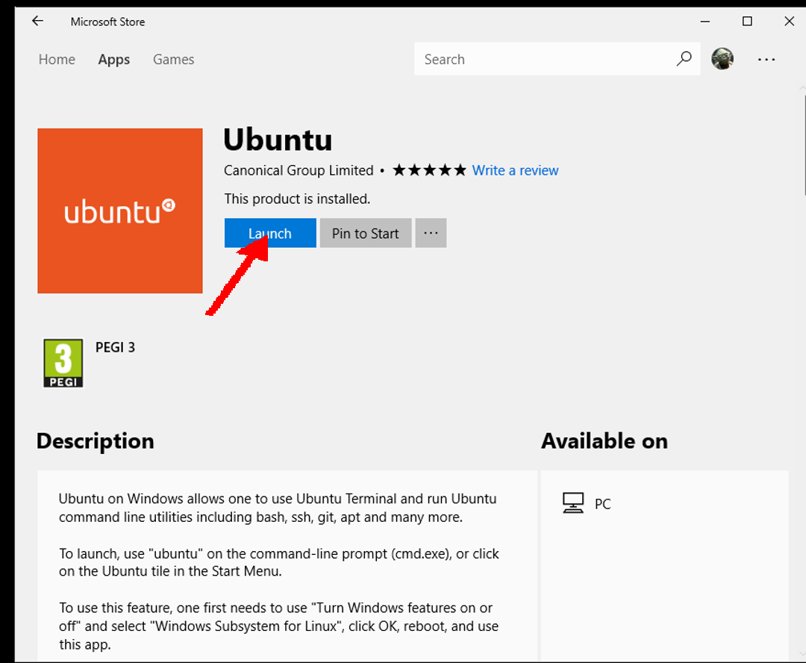

Tunggu beberapa menit...

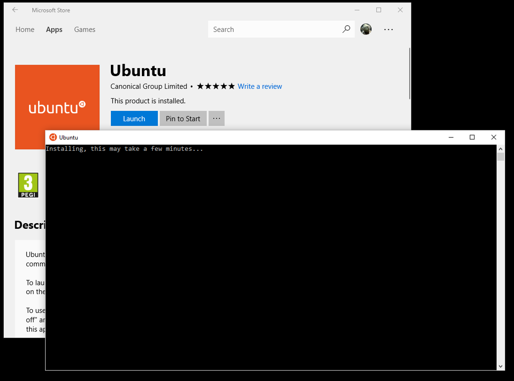

Setup "akun" dan "password" sesuai dengan keyakinan dan kepercayaan masing-masing.
Untuk selanjutnya, di sini akan digunakan akun "dummy".

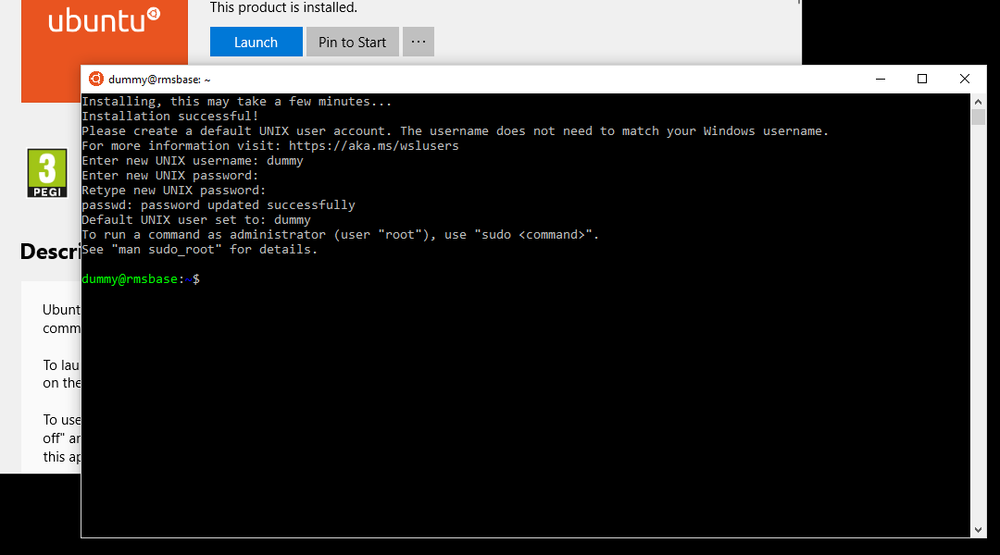

Melalui PowerShell (non admin), silakan masuk ke bash.

```PS
bash
```
Lalukan update

```bash
sudo su -
```

(menjadi superuser)

```bash
apt-get update
apt-get dist-upgrade

```

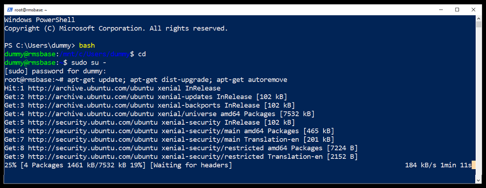

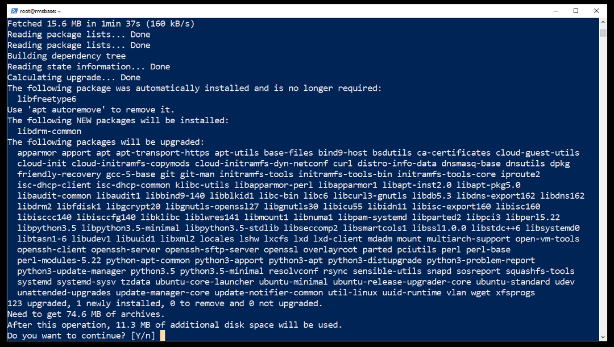

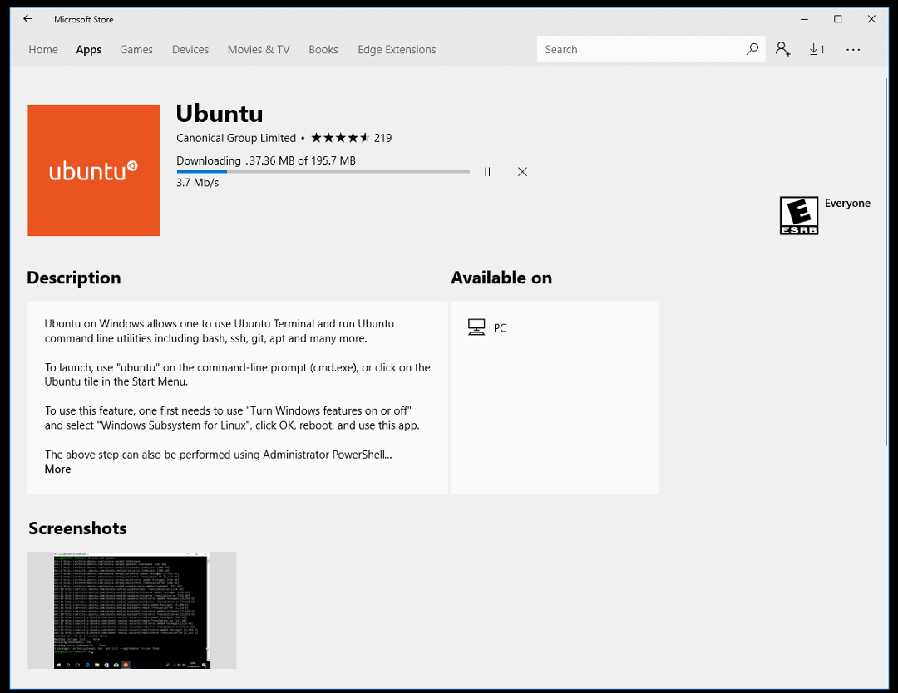

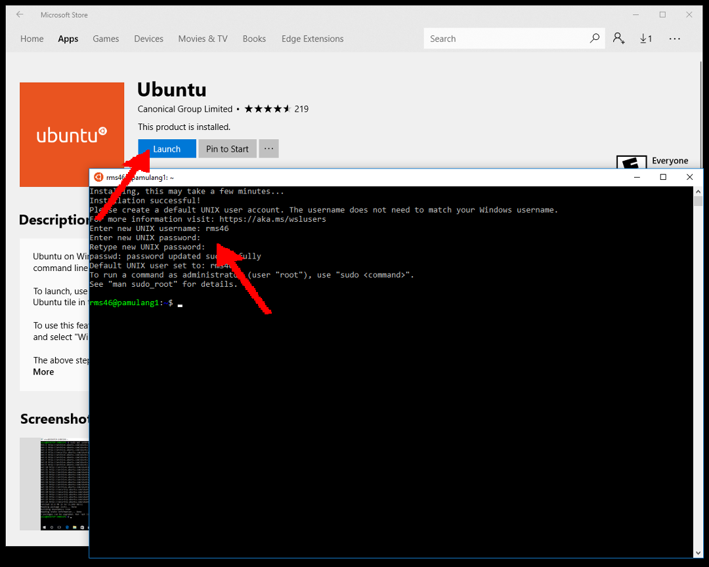

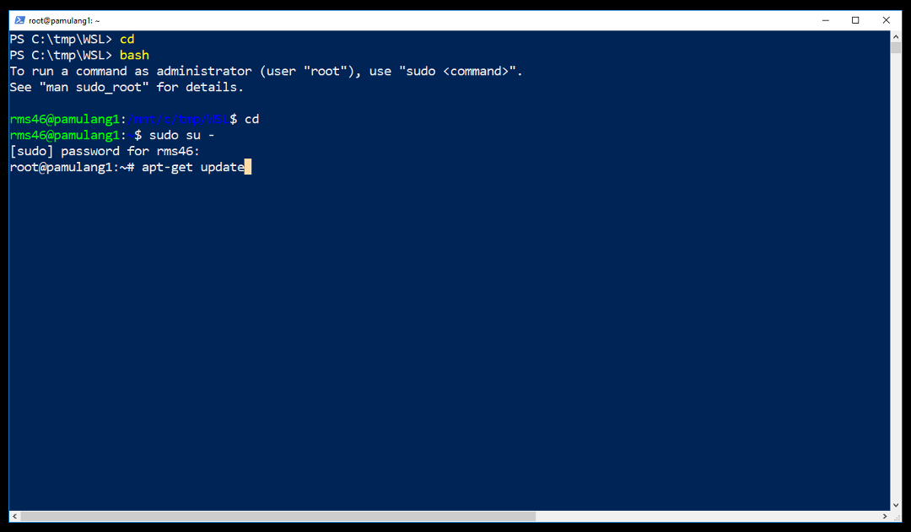

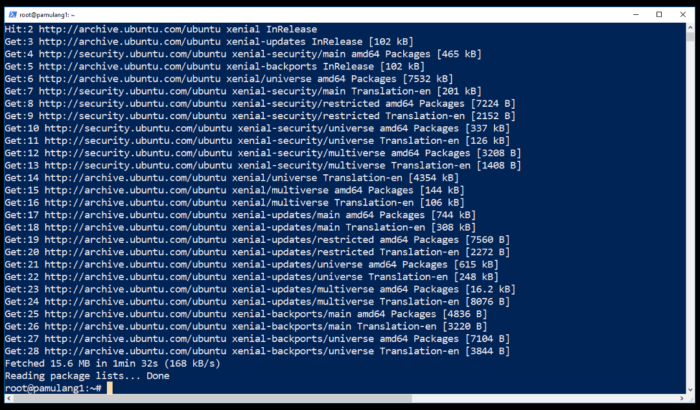

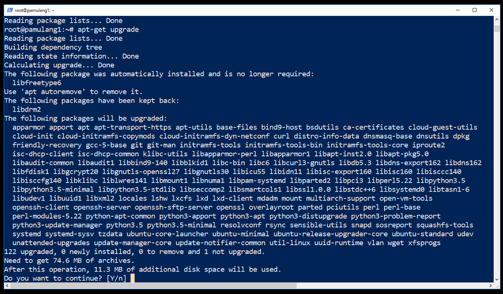


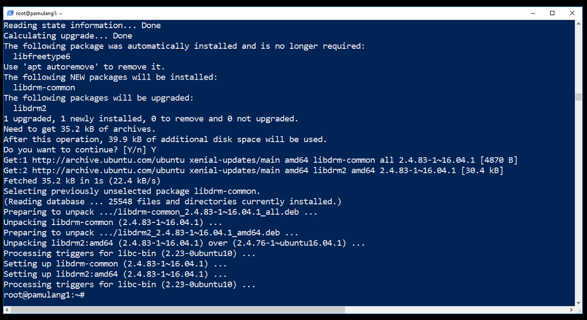


```BASH
DEBPKG="
aptitude
biber
build-essential
fcitx
fcitx-pinyin
fonts-hack-otf
fonts-hack-ttf
fonts-hack-web
fonts-noto
fonts-noto-cjk
fonts-noto-hinted
fonts-noto-mono
fonts-noto-unhinted
gawk
git
gnome-terminal
gnupg
groff
guake
latexmk
ntfs-3g
perl-doc
rsync
texlive-fonts-recommended
texlive-latex-base
texlive-latex-extra
texlive-latex-recommended
usbutils
vim
wget
whiptail
xfce4
xfce4-terminal
xzdec
"
```

```BASH
apt-get install $DEBPKG
```

<!---
https://docs.microsoft.com/en-us/windows/wsl/install-win10
-->

## DISKLAIMER

Tulisan ini terutama untuk <b>KEPERLUAN SENDIRI</b> ---berbasis 
"<i>Google Sana, Google Sini, Coba Itu, Coba Ini, Lalu Tanya-tanyi</i>".
Entah ini <b>PLAGIAT</b>, entah ini <b>RISET</b>, yang jelas tidak pernah ada klaim bahwa ini merupakan karya asli, 
dan belum tentu pula merupakan solusi terbaik :).
Mohon kiranya memberikan tanggapan, terutama jika memiliki solusi alternatif.
Semoga ini bermanfaat di masa mendatang, saat sudah lupa cara menyelesaikan masalah trivia ini.

<a href="http://rahmatm.samik-ibrahim.vlsm.org">Rahmat M. Samik-Ibrahim, revisi 
05--27-Apr-2018</a>
