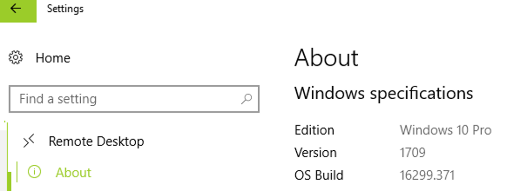
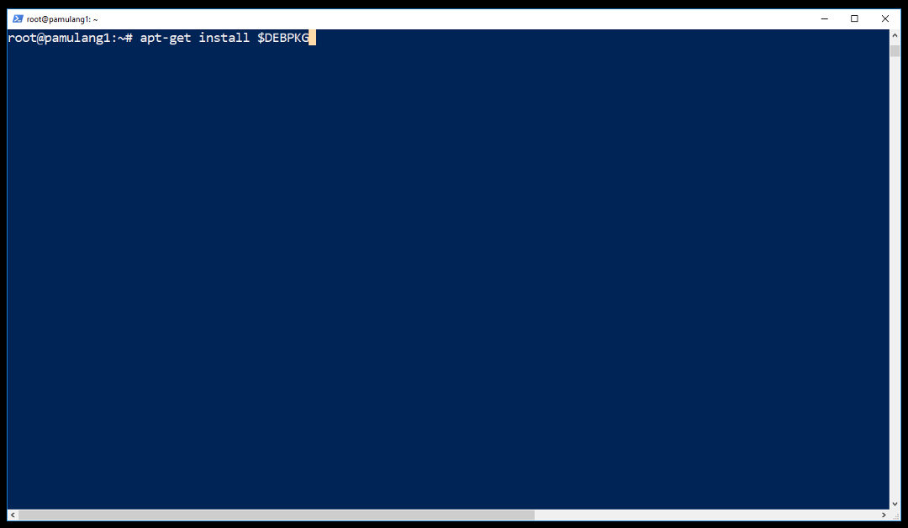
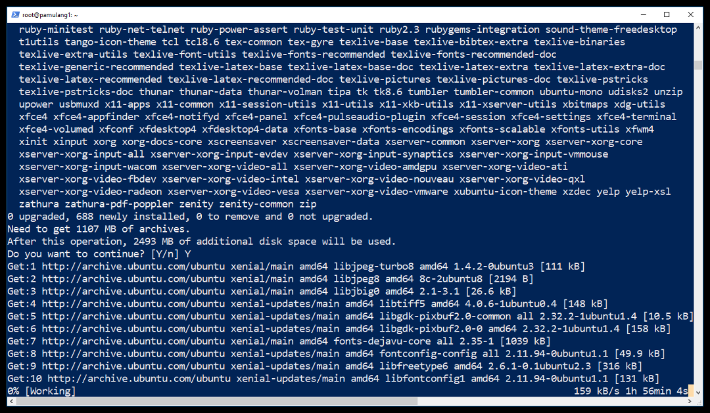

<h1>Install WSL<br>(Windows Subsystem for LaTeX eh Linux :)</h1>


**AWAS!**

* WSL (Windows Subsystem For L*) berkembang sangat cepat, sehingga mungkin anda masih menggunakan versi lama.
  Bahkan, ada versi yang bukan merupakan bagian dari Microsoft Store App.
  Sebaiknya meng-uninstall versi lama tersebut melalui power shell:
 ```PS
 lxrun /uninstall /full
 ```

* Dewasa ini, versi terstabil Microsoft Store ialah Ubuntu 16.04 atau versi Ubuntu 18.04 yang mulai stabil. 
  Versi Ubuntu lama yang tanpa imbuhan 16.04 atau 18.04, sebaiknya tidak lagi digunakan.

* Penginstallan WSL memerlukan data Internet beberapa ratus Mega Bytes!
  Jangan dilakukan jika memiliki kuota data Internet terbatas!

* Jika anda **BUKAN** pakar Windows 10; sebaiknya membuat USER baru di Windows 10 untuk mencoba WSL.
  Jika terjadi hal yang tidak diinginkan, anda tinggal menghapus **USER** Windows tersebut, lalu
  mencoba lagi dengan **USER** baru.

* Lakukan penginstallan hingga tuntas! 
  Pembatalan **INSTALL** ditengah jalan dapat berakibat masalah pada penginstallan berikutnya, 
  karena sisa-sisa penginstallan sebelumnya!

* WSL hanya dapat diaktifkan pada Windows 10 versi 1607 (2016) keatas. 
  Informasi versi tersebut didapatkan dengan mencari "About Your PC" (Setting->System->About).



Pengaktifan WSL dilakukan melalui PowerShell (admin) dengan mengetikkan:

```PS
Enable-WindowsOptionalFeature -Online -FeatureName Microsoft-Windows-Subsystem-Linux
```


Selanjutnya, silakan restart komputer.


Jika pertama kali, seharusnya belum ada "bash" dalam sistem.
Untuk -- jaga-jaga -- silakan test apakah sudah terdapat "bash" (yang seharusnya tidak).


Melalui Microsoft Store, silakan **INSTALL APPS** yaitu **UBUNTU** (sekitar 200MB).


Setelah install, lalu LAUNCH.


Tunggu beberapa menit...


Setelah sukses menginstall, setup "akun" dan "password" sesuai dengan keyakinan dan kepercayaan masing-masing.
Contohnya, di sini akan menggunakan akun bernama "dummy".


- - -

UBUNTU siap untuk digunakan!

Melalui PowerShell (non admin) ketikkan:

```PS
bash
```

Langkah pertama ialah meng-update UBUNTU dengan cara:

```bash
sudo su -
```

(menjadi superuser)

```bash
apt-get update
apt-get dist-upgrade -y
apt-get autoremove -y
apt-get autoclean -y

```


OK di-install.


Langkah terakhir ialah menginstall paket (sebagai superuser) yang terkait dengan LaTeX.
**AWAS**, ukuran total lebih dari 1 GigaByte!

```BASH
DEBPKG="
aptitude
automake
autoconf
bc
biber
bison
build-essential
curl
evince
fakeroot
fcitx
fcitx-pinyin
flex
fonts-hack-otf
fonts-hack-ttf
fonts-hack-web
fonts-noto
fonts-noto-cjk
fonts-noto-hinted
fonts-noto-mono
fonts-noto-unhinted
gawk
gcc-doc
git
gnome-terminal
gnupg
groff
guake
latexmk
libelf-dev
libffi-dev
libgdbm-dev
libgmp-dev
libncurses5-dev
libreadline6-dev
libsqlite3-dev
libssl-dev
libtool
libyaml-dev
ncurses-dev
ntfs-3g
pdftk
perl-doc
rsync
sqlite3
sysstat
texlive-fonts-recommended
texlive-latex-base
texlive-latex-extra
texlive-latex-recommended
usbutils
vim
wget
whiptail
xfce4
xfce4-terminal
xzdec
xz-utils
zlib1g-dev
"
```

```BASH
apt-get install $DEBPKG
```





## DISKLAIMER

Tulisan ini terutama untuk <b>KEPERLUAN SENDIRI</b> ---berbasis 
"<i>Google Sana, Google Sini, Coba Itu, Coba Ini, Lalu Tanya-tanyi</i>".
Entah ini <b>PLAGIAT</b>, entah ini <b>RISET</b>, yang jelas tidak pernah ada klaim bahwa ini merupakan karya asli, 
dan belum tentu pula merupakan solusi terbaik :).
Mohon kiranya memberikan tanggapan, terutama jika memiliki solusi alternatif.
Semoga ini bermanfaat di masa mendatang, saat sudah lupa cara menyelesaikan masalah trivia ini.

<a href="http://rahmatm.samik-ibrahim.vlsm.org">Rahmat M. Samik-Ibrahim, revisi 
14--16-Nov-2018</a>
