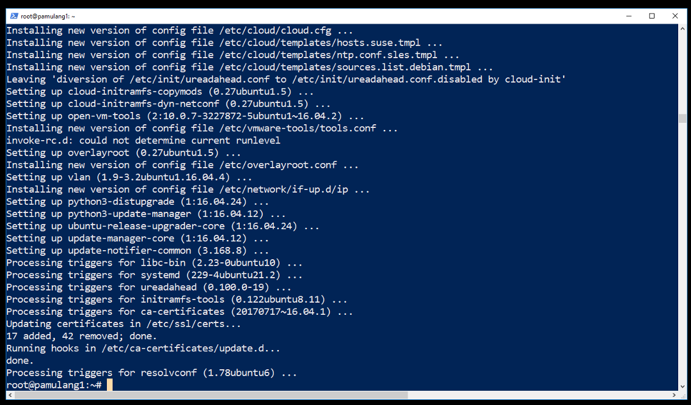

<h1>Install WSL<br>(Windows Subsystem for LaTeX eh Linux :)</h1>


Salam!





```BASH
DEBPKG="
aptitude
biber
build-essential
fcitx
fcitx-pinyin
fonts-hack-otf
fonts-hack-ttf
fonts-hack-web
fonts-noto
fonts-noto-cjk
fonts-noto-hinted
fonts-noto-mono
fonts-noto-unhinted
gawk
git
gnome-terminal
gnupg
groff
guake
latexmk
ntfs-3g
perl-doc
rsync
texlive-fonts-recommended
texlive-latex-base
texlive-latex-extra
texlive-latex-recommended
usbutils
vim
wget
whiptail
xfce4
xfce4-terminal
xzdec
"
```

```BASH
apt-get install $DEBPKG
```

<!---
https://docs.microsoft.com/en-us/windows/wsl/install-win10
-->

## DISKLAIMER

<br />Grrr... memo ini terutama ditulis untuk <b>KEPERLUAN SENDIRI</b>. Tulisan ini berbasis "<i>Google Sana, Google Sini, Coba Itu, Coba Ini, Lalu Tanya-tanyi</i>". Entah ini <b>PLAGIAT</b>, entah ini <b>RISET</b>, yang jelas tidak pernah ada klaim bahwa ini merupakan karya asli, dan belum tentu pula merupakan solusi terbaik :). Mohon kiranya memberikan tanggapan, terutama jika memiliki solusi alternatif. Semoga catatan ini akan bermanfaat di masa mendatang, saat sudah lupa cara menyelesaikan masalah trivia ini.<br /><br />
<div style="text-align: right;"><a 
href="http://rahmatm.samik-ibrahim.vlsm.org">Rahmat M. Samik_ibrahim, revisi 
02--01-Apr-2018</a></div><br />
